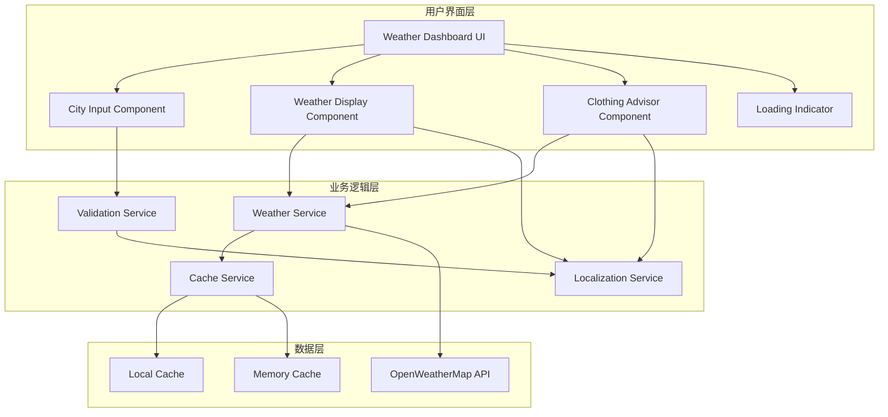
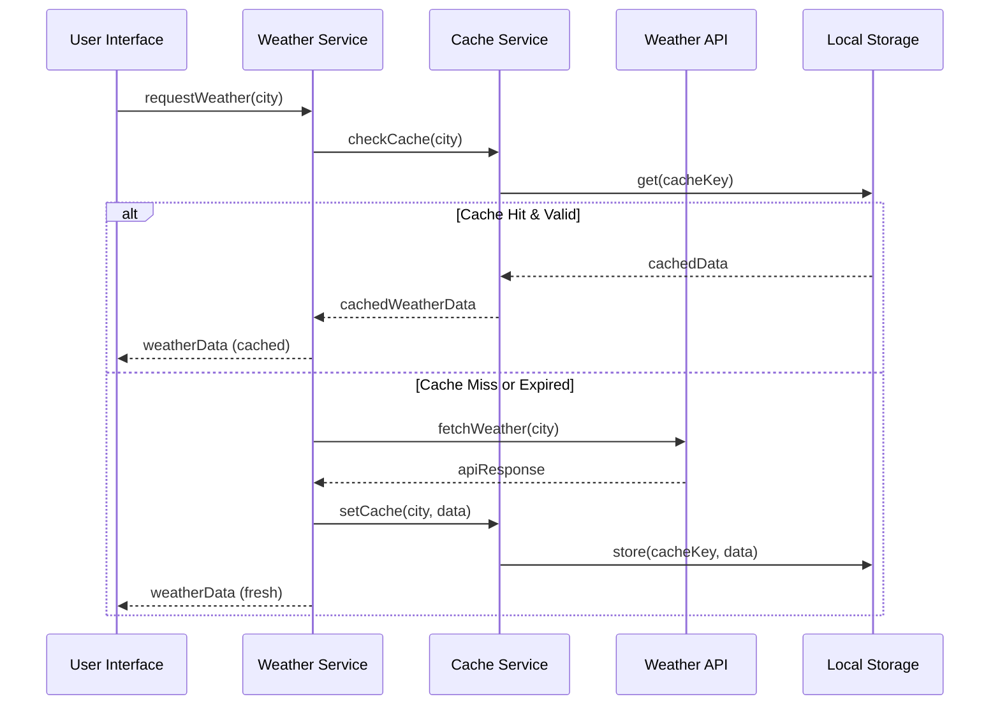
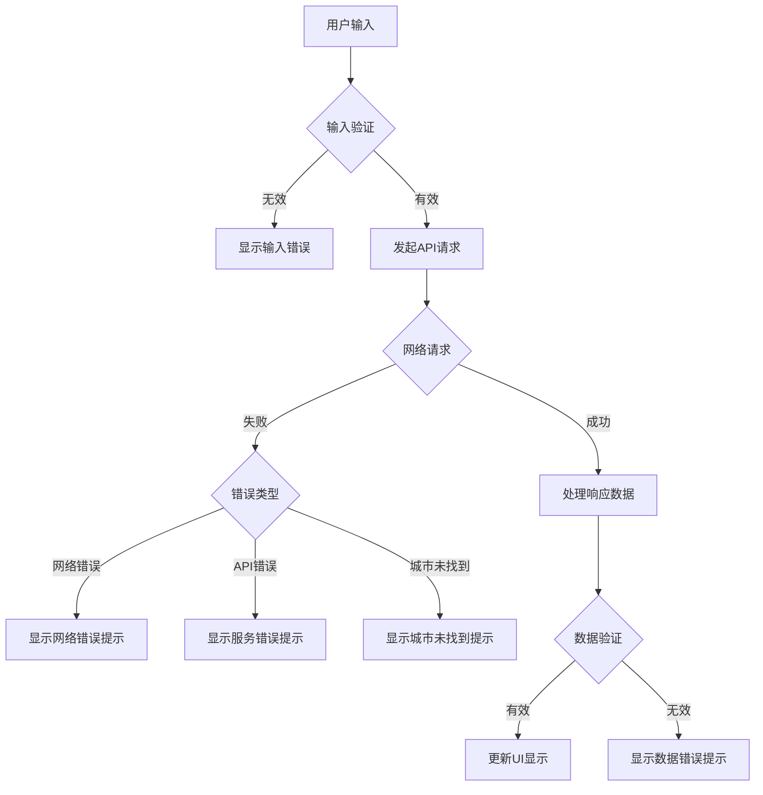

# 设计文档

## 概述

天气仪表盘是一个基于React的现代化Web应用，为用户提供实时天气查询和智能穿衣建议服务。系统采用组件化架构设计，通过集成第三方天气API服务，实现城市天气数据的获取、缓存和展示，同时根据天气条件生成个性化的穿衣建议。

### 核心功能
- 城市天气实时查询
- 智能穿衣建议生成
- 响应式用户界面
- 数据缓存优化
- 多语言支持（中文）
- 错误处理和用户反馈

### 技术栈选择
基于研究发现，系统将采用以下技术栈：
- **前端框架**: React 18+ with TypeScript
- **构建工具**: Vite (更快的开发体验)
- **样式方案**: Tailwind CSS (快速响应式设计)
- **状态管理**: React Context + useReducer (轻量级状态管理)
- **HTTP客户端**: Axios (更好的错误处理和拦截器支持)
- **天气API**: OpenWeatherMap (免费额度充足，文档完善)
- **缓存策略**: localStorage + 内存缓存 (客户端缓存方案)
- **安全配置**: 环境变量管理 API 密钥，避免硬编码

## 架构

### 系统架构图



### 分层架构设计

#### 1. 表现层 (Presentation Layer)
负责用户界面的渲染和交互处理，包含所有React组件。

#### 2. 业务逻辑层 (Business Logic Layer)
处理核心业务逻辑，包括天气数据处理、穿衣建议算法、数据验证等。

#### 3. 数据访问层 (Data Access Layer)
管理数据的获取、缓存和持久化，包括API调用和本地存储。

### 模块化设计原则
- **单一职责**: 每个组件和服务只负责一个特定功能
- **依赖注入**: 通过Context和Props传递依赖
- **接口隔离**: 定义清晰的TypeScript接口
- **开闭原则**: 易于扩展新功能，无需修改现有代码

## 组件和接口

### 核心组件设计

#### 1. WeatherDashboard (主容器组件)
```typescript
interface WeatherDashboardProps {
  initialCity?: string;
}

interface WeatherDashboardState {
  currentWeather: WeatherData | null;
  loading: boolean;
  error: string | null;
  selectedCity: string;
}
```

**职责**:
- 管理应用全局状态
- 协调子组件交互
- 处理错误边界

#### 2. CityInput (城市输入组件)
```typescript
interface CityInputProps {
  onCitySubmit: (city: string) => void;
  loading: boolean;
  error?: string;
}

interface CityInputState {
  inputValue: string;
  validationError: string | null;
}
```

**职责**:
- 接收用户城市输入
- 输入验证和格式化
- 触发天气查询

#### 3. WeatherDisplay (天气显示组件)
```typescript
interface WeatherDisplayProps {
  weatherData: WeatherData;
  timestamp: Date;
  isFromCache: boolean;
}
```

**职责**:
- 展示天气信息
- 显示数据时间戳
- 标识缓存数据

#### 4. ClothingAdvisor (穿衣建议组件)
```typescript
interface ClothingAdvisorProps {
  temperature: number;
  weatherCondition: WeatherCondition;
  humidity: number;
  windSpeed: number;
}

interface ClothingRecommendation {
  category: 'light' | 'medium' | 'heavy';
  items: string[];
  accessories: string[];
  notes: string;
}
```

**职责**:
- 根据天气条件生成穿衣建议
- 考虑温度、天气状况、湿度等因素
- 提供个性化建议

### 服务接口设计

#### 1. WeatherService (天气服务)
```typescript
interface WeatherService {
  getCurrentWeather(city: string): Promise<WeatherData>;
  getForecast(city: string, days: number): Promise<ForecastData>;
  validateCity(city: string): boolean;
}

interface WeatherData {
  city: string;
  temperature: number;
  condition: WeatherCondition;
  humidity: number;
  windSpeed: number;
  description: string;
  timestamp: Date;
}

enum WeatherCondition {
  SUNNY = 'sunny',
  CLOUDY = 'cloudy',
  RAINY = 'rainy',
  SNOWY = 'snowy',
  STORMY = 'stormy'
}
```

#### 2. CacheService (缓存服务)
```typescript
interface CacheService {
  get<T>(key: string): T | null;
  set<T>(key: string, value: T, ttl?: number): void;
  clear(key?: string): void;
  isExpired(key: string): boolean;
}

interface CacheEntry<T> {
  data: T;
  timestamp: number;
  ttl: number;
}
```

#### 3. ValidationService (验证服务)
```typescript
interface ValidationService {
  validateCityName(city: string): ValidationResult;
  sanitizeInput(input: string): string;
}

interface ValidationResult {
  isValid: boolean;
  error?: string;
  sanitized: string;
}
```

## 安全配置

### API 密钥管理

#### 1. 环境变量配置
```typescript
// src/config/env.ts
interface EnvConfig {
  openWeatherApiKey: string;
  openWeatherBaseUrl: string;
  openWeatherUnits: string;
  openWeatherLang: string;
  // ... 其他配置
}

// 安全验证
function validateEnvVars(): void {
  const requiredVars = ['VITE_OPENWEATHER_API_KEY'];
  const missingVars = requiredVars.filter(
    varName => !import.meta.env[varName]
  );
  
  if (missingVars.length > 0) {
    throw new Error(`缺少必需的环境变量: ${missingVars.join(', ')}`);
  }
}
```

#### 2. 安全原则
- ✅ **使用环境变量**: API 密钥存储在 `.env` 文件中
- ✅ **版本控制排除**: `.env` 文件在 `.gitignore` 中
- ✅ **运行时验证**: 启动时验证必需的环境变量
- ✅ **错误处理**: 提供清晰的配置错误提示
- ❌ **禁止硬编码**: 绝不在源代码中直接写入 API 密钥

#### 3. 配置文件结构
```
.env.example          # 配置模板（可提交）
.env                  # 实际配置（不可提交）
.gitignore           # 排除敏感文件
docs/API_SETUP.md    # 配置指南
src/config/env.ts    # 环境变量管理
```

### 生产环境部署

#### 1. 环境变量设置
不同平台的环境变量配置方式：

**Vercel**:
```bash
vercel env add VITE_OPENWEATHER_API_KEY
```

**Netlify**:
在 Dashboard → Environment Variables 中添加

**Docker**:
```dockerfile
ENV VITE_OPENWEATHER_API_KEY=your_api_key_here
```

#### 2. 安全检查清单
- [ ] API 密钥未硬编码在源代码中
- [ ] `.env` 文件已添加到 `.gitignore`
- [ ] 生产环境已正确设置环境变量
- [ ] API 密钥具有适当的访问权限
- [ ] 实施了 API 使用限制监控

## 数据模型

### 核心数据结构

#### 1. 天气数据模型
```typescript
interface WeatherData {
  // 基本信息
  city: string;
  country: string;
  coordinates: {
    lat: number;
    lon: number;
  };
  
  // 天气信息
  temperature: number; // 摄氏度
  feelsLike: number;
  condition: WeatherCondition;
  description: string;
  humidity: number; // 百分比
  pressure: number; // hPa
  visibility: number; // km
  
  // 风力信息
  windSpeed: number; // km/h
  windDirection: number; // 度数
  
  // 时间信息
  timestamp: Date;
  sunrise: Date;
  sunset: Date;
  
  // 元数据
  source: 'api' | 'cache';
  apiProvider: string;
}
```

#### 2. 穿衣建议数据模型
```typescript
interface ClothingRecommendation {
  // 基本分类
  category: ClothingCategory;
  
  // 具体建议
  upperBody: string[];
  lowerBody: string[];
  footwear: string[];
  accessories: string[];
  
  // 特殊建议
  specialNotes: string[];
  
  // 元数据
  confidence: number; // 0-1
  reasoning: string;
  basedOn: {
    temperature: number;
    condition: WeatherCondition;
    humidity: number;
    windSpeed: number;
  };
}

enum ClothingCategory {
  LIGHT = 'light',      // 轻便装
  MEDIUM = 'medium',    // 适中装
  HEAVY = 'heavy',      // 厚重装
  RAIN = 'rain',        // 雨天装
  SNOW = 'snow'         // 雪天装
}
```

#### 3. 缓存数据模型
```typescript
interface CacheEntry<T> {
  key: string;
  data: T;
  timestamp: number;
  ttl: number; // 生存时间（毫秒）
  version: string; // 数据版本
  metadata: {
    source: string;
    size: number;
    accessCount: number;
    lastAccessed: number;
  };
}

interface CacheConfig {
  defaultTTL: number; // 默认10分钟
  maxSize: number; // 最大缓存条目数
  cleanupInterval: number; // 清理间隔
  storageType: 'memory' | 'localStorage' | 'both';
}
```

### 数据流设计

#### 1. 天气查询数据流


#### 2. 错误处理数据流


## 错误处理

### 错误分类和处理策略

#### 1. 输入验证错误
```typescript
enum InputErrorType {
  EMPTY_CITY = 'EMPTY_CITY',
  INVALID_CHARACTERS = 'INVALID_CHARACTERS',
  TOO_LONG = 'TOO_LONG',
  TOO_SHORT = 'TOO_SHORT'
}

interface InputError {
  type: InputErrorType;
  message: string;
  field: string;
}
```

**处理策略**:
- 实时输入验证
- 友好的错误提示
- 输入建议和自动修正

#### 2. 网络请求错误
```typescript
enum NetworkErrorType {
  TIMEOUT = 'TIMEOUT',
  NO_CONNECTION = 'NO_CONNECTION',
  SERVER_ERROR = 'SERVER_ERROR',
  API_LIMIT_EXCEEDED = 'API_LIMIT_EXCEEDED',
  CITY_NOT_FOUND = 'CITY_NOT_FOUND'
}

interface NetworkError {
  type: NetworkErrorType;
  message: string;
  statusCode?: number;
  retryable: boolean;
  retryAfter?: number;
}
```

**处理策略**:
- 自动重试机制（指数退避）
- 降级到缓存数据
- 用户友好的错误消息
- 重试按钮提供

#### 3. 数据处理错误
```typescript
enum DataErrorType {
  INVALID_RESPONSE = 'INVALID_RESPONSE',
  MISSING_FIELDS = 'MISSING_FIELDS',
  CACHE_CORRUPTION = 'CACHE_CORRUPTION',
  PARSING_ERROR = 'PARSING_ERROR'
}
```

**处理策略**:
- 数据验证和清理
- 默认值填充
- 错误日志记录
- 用户通知

### 错误边界实现
```typescript
interface ErrorBoundaryState {
  hasError: boolean;
  error: Error | null;
  errorInfo: ErrorInfo | null;
}

class WeatherErrorBoundary extends Component<Props, ErrorBoundaryState> {
  // 捕获组件树中的JavaScript错误
  // 提供降级UI
  // 错误报告和日志
}
```

## 正确性属性

*属性是一个特征或行为，应该在系统的所有有效执行中保持为真——本质上，是关于系统应该做什么的正式声明。属性作为人类可读规范和机器可验证正确性保证之间的桥梁。*

基于需求分析，以下核心业务逻辑适合属性测试：

### 属性 1: 综合穿衣建议生成

*对于任何*温度和天气状况的组合，穿衣建议应该同时考虑温度范围（低于10°C建议保暖衣物，10-20°C建议适中衣物，高于20°C建议轻便衣物）和特殊天气条件（雨天建议雨具，雪天建议防滑鞋和保暖衣物）

**验证需求: 需求 2.1, 2.2, 2.3, 2.4, 2.5, 2.6**

### 属性 2: 输入验证一致性

*对于任何*仅由空白字符组成的字符串，城市输入验证应该拒绝输入并显示要求输入城市名称的提示信息

**验证需求: 需求 4.1**

### 属性 3: 缓存命中行为

*对于任何*城市，如果在10分钟内重复查询，天气服务应该返回缓存的数据而不是发起新的API请求

**验证需求: 需求 5.1**

### 属性 4: 缓存过期行为

*对于任何*缓存数据超过10分钟的城市查询，天气服务应该重新获取最新的天气数据并更新缓存

**验证需求: 需求 5.2**

### 属性 5: 缓存隔离性

*对于任何*多个不同的城市，每个城市的缓存操作（存储、获取、过期）应该相互独立，不会影响其他城市的缓存状态

**验证需求: 需求 5.3**

### 属性 6: 错误日志完整性

*对于任何*类型的错误（网络错误、API错误、验证错误），系统应该记录包含错误类型、时间戳、错误消息和上下文信息的完整日志条目

**验证需求: 需求 4.4**

### 属性 7: 中文本地化一致性

*对于任何*系统输出（天气状况描述、穿衣建议、错误消息、城市名称处理），内容应该正确地本地化为中文显示

**验证需求: 需求 6.2, 6.3, 6.4, 6.5**

## 测试策略

### 双重测试方法

本项目采用单元测试和属性测试相结合的综合测试策略：

- **单元测试**: 验证具体示例、边界情况和错误条件
- **属性测试**: 验证跨所有输入的通用属性（适用时）
- **集成测试**: 验证组件间交互和外部服务集成

### 属性测试配置

对于适用属性测试的功能：
- 使用 **fast-check** 作为属性测试库
- 每个属性测试最少运行 **100次迭代**
- 每个属性测试必须引用其设计文档属性
- 标签格式: **Feature: weather-dashboard, Property {number}: {property_text}**

### 测试金字塔结构

#### 1. 单元测试 (70%)
**测试范围**:
- 纯函数和工具方法（输入验证、数据转换）
- 组件的独立功能
- 服务类的业务逻辑（穿衣建议算法、缓存逻辑）
- 错误处理逻辑

**属性测试应用**:
- 穿衣建议算法的正确性属性
- 输入验证的一致性属性
- 缓存行为的正确性属性
- 本地化功能的完整性属性

**示例测试用例**:
- 城市名称验证逻辑
- 穿衣建议算法
- 缓存服务功能
- 错误处理逻辑
- 数据格式转换

#### 2. 集成测试 (20%)
**测试范围**:
- 组件间交互
- 外部API集成（OpenWeatherMap）
- 缓存机制端到端测试
- 错误流程集成

**测试场景**:
- 完整的天气查询流程
- 缓存命中和未命中场景
- 网络错误恢复
- 用户交互流程

#### 3. 端到端测试 (10%)
**测试范围**:
- 用户完整使用流程
- 跨浏览器兼容性
- 响应式设计验证

**测试工具**:
- Playwright

**关键场景**:
- 用户输入城市并获取天气信息
- 错误状态的用户体验
- 移动端响应式布局

### 测试工具配置

```typescript
// 属性测试示例配置
import fc from 'fast-check';

// Feature: weather-dashboard, Property 1: 综合穿衣建议生成
test('clothing recommendations consider both temperature and weather conditions', () => {
  fc.assert(fc.property(
    fc.float({ min: -20, max: 50 }), // 温度范围
    fc.oneof(
      fc.constant('sunny'),
      fc.constant('rainy'), 
      fc.constant('snowy'),
      fc.constant('cloudy')
    ), // 天气状况
    (temperature, condition) => {
      const recommendation = clothingAdvisor.getRecommendation(temperature, condition);
      
      // 验证温度相关建议
      if (temperature < 10) {
        expect(recommendation.items).toContain('厚外套');
      } else if (temperature >= 10 && temperature <= 20) {
        expect(recommendation.items).toContain('轻薄外套');
      } else {
        expect(recommendation.items).toContain('轻便衣物');
      }
      
      // 验证天气状况相关建议
      if (condition === 'rainy') {
        expect(recommendation.accessories).toContain('雨具');
      }
      if (condition === 'snowy') {
        expect(recommendation.footwear).toContain('防滑鞋');
      }
    }
  ), { numRuns: 100 });
});
```

### 性能测试
- 组件渲染性能（React DevTools Profiler）
- API响应时间监控
- 缓存效率测量
- 内存使用情况分析
- 包大小优化验证

### 可访问性测试
- 键盘导航完整性
- 屏幕阅读器支持（NVDA/JAWS测试）
- 颜色对比度验证（WCAG 2.1 AA标准）
- ARIA标签完整性检查
- 焦点管理测试

### 测试覆盖率目标
- 代码覆盖率: ≥90%
- 分支覆盖率: ≥85%
- 函数覆盖率: ≥95%
- 属性测试覆盖: 所有核心业务逻辑